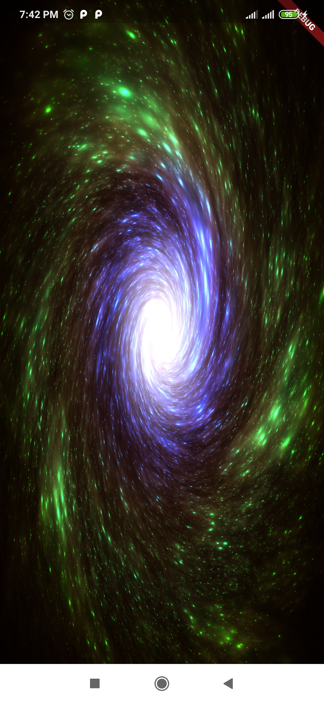
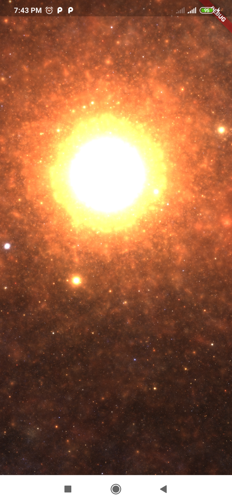

# Shaders in Flutter

A Flutter project for experimenting with shaders.

## Description

This project is a simple Flutter application that allows you to play with shaders. Shaders are small programs that run on the GPU and are used to manipulate the appearance of graphics.

## Features

- Display and interact with various shaders.\
- Customize shader parameters to achieve different visual effects.\
- Explore and experiment with shader programming.

## Screenshots

|  |  |
|:---:|:---:|
|Galaxy of universes|Star nest|

## Usage

1\. Clone and run the application.
2\. Explore the two shaders by changing the shader name in the _loadShader method.\
3\. Modify the shader code in `lib/shaders` to experiment and create your visual effects.

## Contributing

Contributions are welcome! If you have any suggestions, bug reports, or feature requests, please open an issue or submit a pull request.

## License

The project is released under the [MIT License](LICENSE).

## Acknowledgments

- [ShaderToy](https://www.shadertoy.com) - A website that inspired this project and provided the shader code.

Feel free to add or modify the sections as necessary and include any additional information you'd like to provide about your project.
